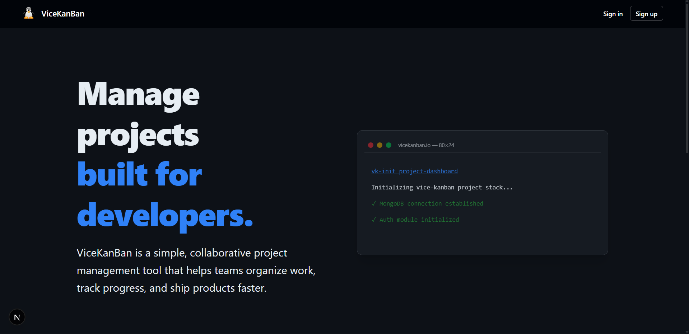
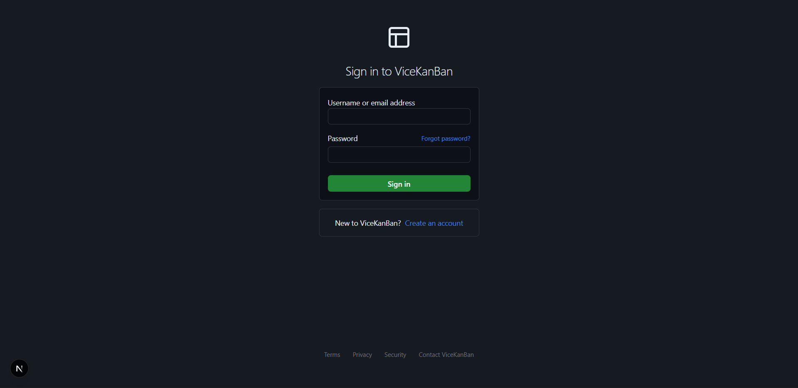
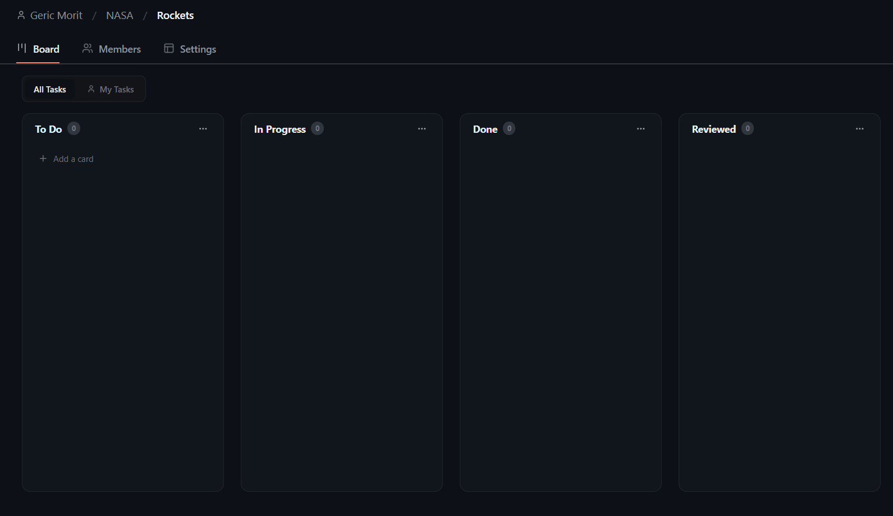

<p align="center">
  
</p>

<h1 align="center">ViceKanBan</h1>

<p align="center">
  <strong>A high-performance, GitHub-inspired project management platform for developer teams.</strong><br/>
  Orchestrate your workflow, track project velocity, and collaborate with precision.
</p>

<div align="center">
  
  
  
</div>

---

## Overview

**ViceKanBan** is a premium Kanban project management ecosystem designed for clarity and efficiency. Borrowing the robust design language of GitHub, it offers an information-dense yet intuitive interface that developers already know and love.

This repository serves as the **Frontend Ecosystem**, engineered with Next.js (App Router) for optimized performance and a seamless client-side experience.

---

## Preview

<details open>
<summary><b>Screenshots</b></summary>

| **Landing & Concept** | **User Authentication** |
| :---: | :---: |
|  |  |

| **Kanban Board** |
| :---: |
|  |

</details>

---

## Key Features

- **GitHub-Inspired UX**: Information-dense, clean layout with a focus on hierarchy and developers' familiarity.
- **Organization Workspaces**: Create high-level workspaces with multiple projects and granular member management.
- **Smart Member Roles**: Define roles including **Owner**, **Co-owner**, and **Developer** with specific access control.
- **Dynamic Kanban**: Fluid drag-and-drop task management powered by `dnd-kit`, featuring restricted columns for reviewed work.
- **Collaborative Threads**: Integrated task discussions with nested replies and threaded conversation support.
- **Security First**: 
  - JWT-based authentication via secure cookies.
  - **Auto-Purge Protocol**: Complete session cleansing (Cookies & LocalStorage) upon logout for maximum security.
  - **State Persistence**: Optimized context management to prevent stale data display during navigation.

---

## Tech Stack

| Domain | Technology |
|---|---|
| **Core Framework** | [Next.js 16](https://nextjs.org/) (App Router) |
| **Styling** | [Tailwind CSS v4](https://tailwindcss.com/) |
| **State & Navigation** | [framer-motion](https://www.framer.com/motion/), [lucide-react](https://lucide.dev/) |
| **Logic Layer** | [dnd-kit](https://dndkit.com/), [js-cookie](https://github.com/js-cookie/js-cookie) |
| **Networking** | [socket.io-client](https://socket.io/) (Real-time events) |

---

## Getting Started

### Prerequisites
- Node.js 18+
- A running instance of the [ViceKanBan Backend](https://github.com/gericandmorty/vice-kanban-backend)

### Installation

1. **Clone the repository**
   ```bash
   git clone https://github.com/gericandmorty/ViceKanban.git
   cd ViceKanban/frontend
   ```

2. **Install dependencies**
   ```bash
   npm install
   ```

3. **Configure Environment**
   Create a `.env.local` file in the root:
   ```env
   NEXT_PUBLIC_API_URL=http://your-backend-api-url
   ```

4. **Launch Development Server**
   ```bash
   npm run dev
   ```

Access the application at `http://localhost:3000`.

---

## Recent Updates

> [!NOTE]
> **Developer Showcase & Identity Upgrade (v1.0.2)**
> - **Portfolio Spotlight**: Integrated a dynamic desktop-scaling engine for developer portfolios in the About page.
> - **Visual Alignment**: Standardized Privacy, Terms, and About pages with a cohesive GitHub-inspired dark theme.
> - **Team Expansion**: Added Jherson Aguto as Lead Mobile Developer; updated professional credentials and interactive contact cards.
> - **Security Audit**: Verified and hardened the Auto-Purge Protocol to ensure 100% session isolation on public machines.

---

## Contact

For inquiries or professional collaboration, please reach out to the core development team:

- **Geric Morit** (Full-Stack Engineer) – [gericmorit.dev@gmail.com](mailto:gericmorit.dev@gmail.com) | [Portfolio](https://geric.vercel.app/)
- **Jherson Aguto** (Mobile Developer) – [agutojherson@gmail.com](mailto:agutojherson@gmail.com) | [Portfolio](https://jherson.onrender.com/)

---

<p align="center">
  Built for the Developer Community.
</p>
