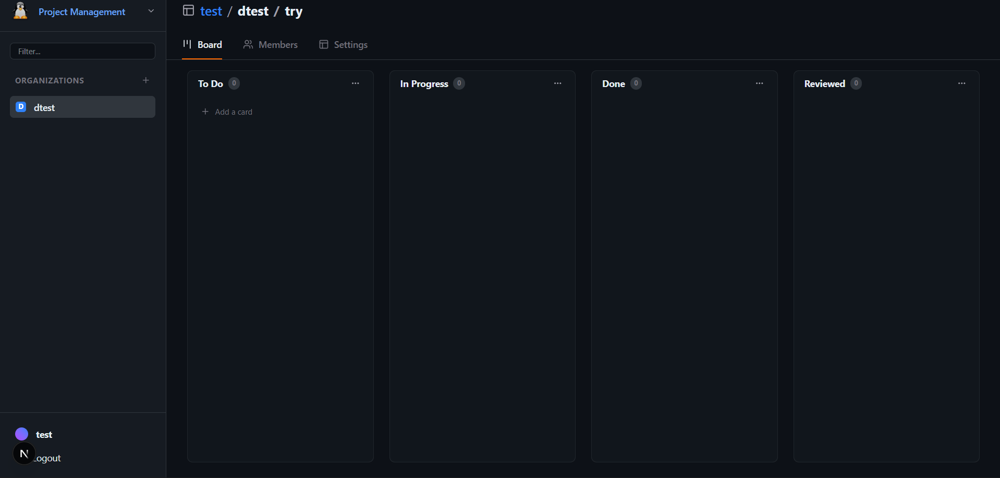

<p align="center">
  
</p>

<h1 align="center">ViceKanBan</h1>

<p align="center">
  A professional, GitHub-inspired project management tool built for developer teams.<br/>
  Organize work, track progress, and collaborate — all in one place.
</p>

---

## Overview

ViceKanBan is a full-stack Kanban project management application designed to feel familiar to developers. It draws its design language from GitHub — clean, information-dense, and professional — while providing the core workflow tools that small to mid-sized development teams need.

The frontend is built with Next.js (App Router) and Tailwind CSS. It communicates with a separate NestJS backend over a REST API secured with JWT authentication. This repository contains only the frontend.

---

## Screenshots

**Landing Page**


**Login**


**Kanban Board**



---

## How It Works

### Authentication

Users register and log in through the auth pages. Upon successful login, the backend issues a JWT access token which the frontend stores in a cookie. Every subsequent API request attaches this token in the Authorization header. If the token is missing or expired, the middleware redirects the user back to the login page.

### Organizations

After logging in, users land on the dashboard. The first step is to create or join an Organization. An Organization is a shared workspace — similar to a GitHub organization — that can contain multiple projects and multiple members. The owner of an organization can invite other registered users by their username. Invited users will see a pending invitation on their dashboard, which they can accept or decline.

### Projects

Inside an organization, owners can create Projects. A project represents a specific product, feature, or initiative the team is working on. Each project has its own dedicated Kanban board.

### Kanban Board

The Kanban board is the core of the application. Each board has four columns representing the lifecycle of a task:

- **To Do** — work that has been defined but not started
- **In Progress** — work that is actively being developed
- **Done** — work that is complete from the developer's perspective
- **Reviewed** — work that has been reviewed and signed off (restricted to org owners and project creators)

Tasks can be created directly from a column. Each task has a title, description, an assignee (any member of the org), and a status. Tasks can be dragged and dropped between columns to update their status. Drag permissions are enforced: a task can only be moved by the org owner, the project creator, the task creator, or the assigned user.

Clicking on a task card expands a detail view where users can edit, comment, and reply to comments in a discussion-style thread. Destructive actions such as deleting a task or removing a member are gated behind a confirmation modal to prevent mistakes.

### Member Management

The Members tab inside an organization lists all current members with their roles. The organization owner can remove members directly from this view. Removed members lose access to all projects within that organization.

---

## Tech Stack

| Layer | Technology |
|---|---|
| Framework | Next.js 16 (App Router) |
| Styling | Tailwind CSS v4 |
| Animations | Framer Motion |
| Drag and Drop | dnd-kit |
| Auth | JWT via cookies (js-cookie) |
| Icons | Lucide React |
| Notifications | React Hot Toast |

---

## Getting Started (Frontend Only)

```bash
# Install dependencies
npm install

# Create environment file
cp .env.example .env.local
# Set NEXT_PUBLIC_API_URL to your backend URL

# Run development server
npm run dev
```

The app will be available at `http://localhost:3000`.

---

## Backend

This repository contains only the frontend. The backend is a separate NestJS application using MongoDB (Mongoose) that provides all the REST API endpoints.

If you need access to the backend repository or have questions about the project, contact the author:

**gericmorit.dev@gmail.com**

---

## Author

Built by **Geric Morit**.
